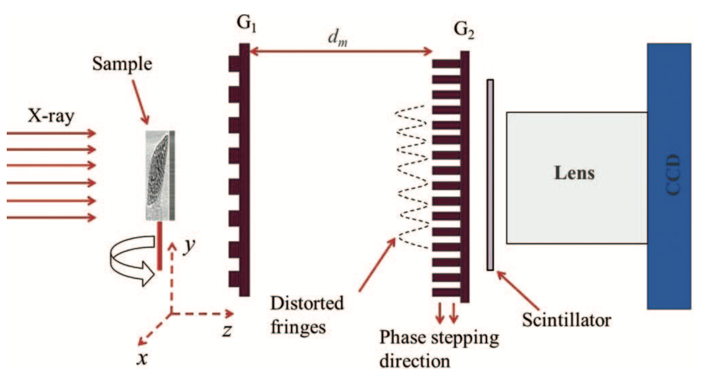

======
wavepy
======

`wavepy <https://github.com/APS-XSD-OPT-Group/wavepy>`_ is Python library for data analyses of coherence and wavefront measurements at synchrotron beamlines. Currently it covers: single-grating imaging, speckle tracking, scan of Talbot peaks for coherence.

Credits
-------

We kindly request that you cite the following article 
:cite:`cite:01` and :cite:`cite:02` if you use wavepy.

Contribute
----------

* Documentation: https://github.com/APS-XSD-OPT-Group/wavepy/tree/master/doc
* Issue Tracker: https://github.com/APS-XSD-OPT-Group/wavepy/issues
* Source Code: https://github.com/APS-XSD-OPT-Group/wavepy/

Content
-------

.. toctree::
   :maxdepth: 1

   source/about
   source/install
   source/devguide
   source/api
   source/demo
   source/credits
